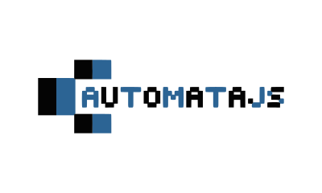

<h1 align="center">
  
</h1>

<h2 align="center">
  <a href="https://automatajs.com/">AutomataJS.com</a>
</h2>

# Breakdown

AutomtaJS is a web application for exploring 2D [cellular automata](https://en.wikipedia.org/wiki/Cellular_automaton).
Differently from most cellular automata implementations, AutomataJS uses [ThreeJS](https://github.com/mrdoob/three.js/) and [glsl](https://en.wikipedia.org/wiki/OpenGL_Shading_Language) in order to parallalize the computation of each pixel state via shaders.

# Main Features

AutomataJS allows users to change the color, size and type of the automata,
moreover all these parameters can be modified while the automata is running thus creating weird and unpredictable results.

## Currently Supported automata

1. [Game of Life](https://en.wikipedia.org/wiki/Conway%27s_Game_of_Life)
2. [Maze](https://www.conwaylife.com/wiki/OCA:Maze)
3. [Seeds](<https://en.wikipedia.org/wiki/Seeds_(cellular_automaton)>)
4. [Brians's Brain](https://en.wikipedia.org/wiki/Brian%27s_Brain)
5. [Day And Night](<https://en.wikipedia.org/wiki/Day_and_Night_(cellular_automaton)>)

# Setup a Development Environment

1.  ## Install node

    - ### On Ubuntu, Debian and Linux Mint
            sudo apt install npm
    - ### On CentOS 8 (and newer), Fedora, and Red Hat:

            sudo dnf install npm

    - ### On CentOS 6 and 7, and older versions of Red Hat

            sudo yum install epel-release
            sudo yum install npm

    - ### On Arch Linux and Manjaro:

            sudo pacman -S npm

    - ### On OpenSUSE

            sudo zypper install npm

    - ### On OSX or Windows

      Download the installer from https://nodejs.org/en/download/

2.  ## Clone AutomataJS repository

        git clone https://github.com/bisignam/automatajs.git

3.  ## Install project dependencies via npm

        cd automatajs
        npm install

4.  ## Launch development server

        ng serve

    Navigate to `http://localhost:4200/`. The app will automatically reload if you change any of the source files.

# Development Roadmap

- Add possibility to define custom automaton, for instance by editing a shader file using the [Monaco Editor](https://github.com/Microsoft/monaco-editor)
- Make the application mobile friendly.
- Manage resize of window.
- Introduce usage of a logging library.

# Contribute

Feel free to to create a pull request or directly contact me at bisignam@gmail.com if you encounter any problem or you have any suggestion.
If you don't know where to start looking for possible contributions, check the [Development Roadmap](##development-roadmap) section.

# License

This project is licensed under the terms of the MIT license.

See [LICENSE](LICENSE) for more information.

# Thanks to

[John Horton Conway](https://en.wikipedia.org/wiki/John_Horton_Conway) for his stunning work and intuition, R.I.P

[James Fisher](https://jameshfisher.com/) for the great inspiration, the core of this project is based on his article [Game Of Life Implemented With a Fragment Shader](https://jameshfisher.com/2017/10/22/webgl-game-of-life/)
